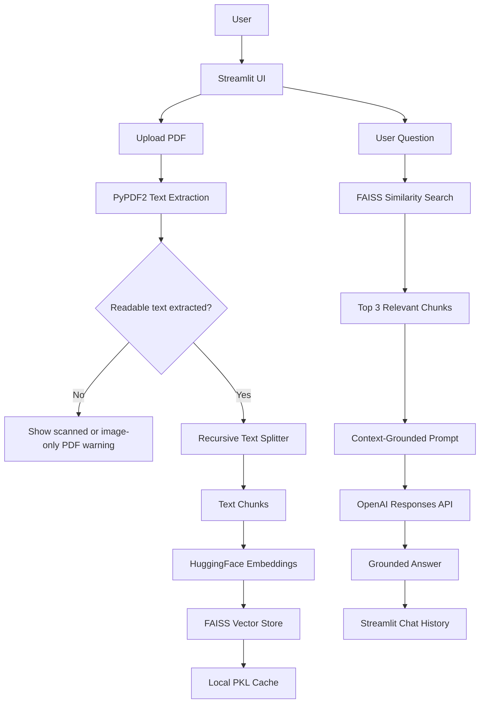
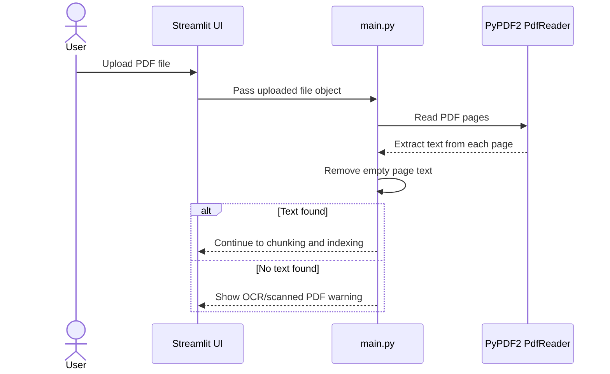
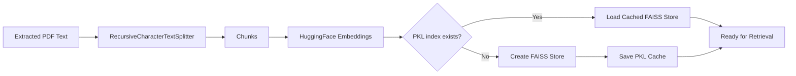
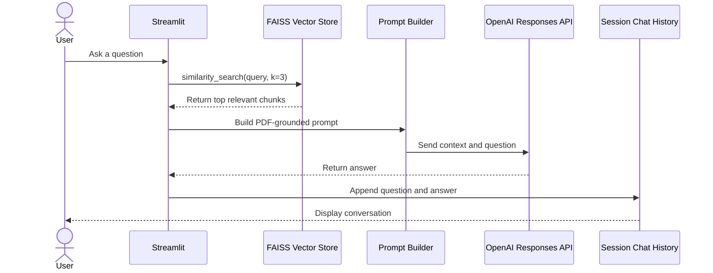
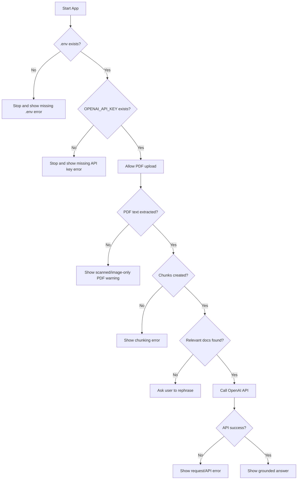
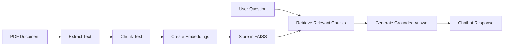

# PDF Summarizer Chatbot

<p align="center">
  <b>A Streamlit-powered RAG chatbot that lets users upload a PDF, index its content locally, and ask grounded questions over the document.</b>
</p>

<p align="center">
  
  
  
  
  
  
</p>

---

## Overview

**PDF Summarizer Chatbot** is a document-question-answering application built with **Streamlit**, **LangChain**, **FAISS**, **HuggingFace sentence-transformer embeddings**, and the **OpenAI Responses API**.

The project implements a practical **Retrieval-Augmented Generation** pipeline:

1. Upload a PDF.
2. Extract readable text from the PDF.
3. Split the text into overlapping chunks.
4. Embed the chunks with `sentence-transformers/all-MiniLM-L6-v2`.
5. Store or load the vectors with FAISS.
6. Ask a natural-language question.
7. Retrieve the most relevant PDF chunks.
8. Generate a grounded answer using only the retrieved context.

This makes the app useful for reading research papers, notes, reports, manuals, assignments, business documents, and other selectable-text PDFs.

---

## Core Features

- PDF upload interface using Streamlit.
- PDF text extraction using `PyPDF2`.
- Safe handling for unreadable or image-only PDFs.
- Recursive chunking with overlap for better retrieval quality.
- HuggingFace embedding generation.
- FAISS-based semantic search.
- Local `.pkl` vector-store caching per uploaded PDF name.
- OpenAI Responses API call through direct `requests`.
- Context-grounded prompting: the model is instructed to answer only from PDF context.
- Streamlit session-state chat history.
- Defensive API and extraction error handling.

---

## Tech Stack

| Layer | Technology |
|---|---|
| App UI | Streamlit |
| PDF Parser | PyPDF2 |
| Text Splitting | LangChain `RecursiveCharacterTextSplitter` |
| Embeddings | HuggingFace `sentence-transformers/all-MiniLM-L6-v2` |
| Vector Store | FAISS |
| LLM API | OpenAI Responses API |
| HTTP Client | `requests` |
| Environment Variables | `python-dotenv` |
| Image Handling | Pillow |
| Type Checking | Pyright |

---

## System Architecture



---

## Workflows

### 1. PDF Upload and Text Extraction



The `extract_text_safe()` function reads each page and joins the extracted text into a single document string. If extraction fails or returns no usable text, the app stops gracefully.

---

### 2. Chunking and Vector Indexing



The app currently uses:

```python
chunk_size = 1000
chunk_overlap = 200
```

The overlap preserves nearby context across chunk boundaries, which usually improves retrieval quality for longer PDFs.

---

### 3. Question Answering Flow



The retrieval step uses the top 3 chunks:

```python
VectorStore.similarity_search(query=query, k=3)
```

Those chunks are placed into the prompt before the model is called.

---

### 4. Error Handling Flow



The app includes practical checks for missing environment variables, unreadable PDFs, empty chunk output, corrupted cached indexes, no retrieval hits, and OpenAI request failures.

---

## Repository Structure

```text
PDF-Summarizer-Chatbot/
├── main.py                 # Main Streamlit application and RAG pipeline
├── requirements.txt        # pip dependency list
├── pyproject.toml          # Python project metadata and dependency config
├── pyrightconfig.json      # Pyright type-checking configuration
└── README.md               # Project documentation
```

### Runtime-generated local files

```text
PDF-Summarizer-Chatbot/
├── .env                    # Local environment variables, not meant for Git
└── <uploaded_pdf_name>.pkl  # Cached FAISS vector store for each uploaded PDF
```

The `.pkl` files are generated automatically after PDF indexing. They help the app avoid rebuilding embeddings for the same PDF name.

---

## Environment Variables

Create a `.env` file in the project root:

```env
OPENAI_API_KEY=your_openai_api_key_here
```

The application checks for `.env` at startup. If the file or API key is missing, the app stops and displays an error.

---

## Installation

### 1. Clone the repository

```bash
git clone https://github.com/muhammadhasaan82/PDF-Summarizer-Chatbot.git
cd PDF-Summarizer-Chatbot
```

### 2. Create a virtual environment

```bash
python -m venv .venv
```

### 3. Activate the environment

Windows:

```bash
.venv\Scripts\activate
```

macOS/Linux:

```bash
source .venv/bin/activate
```

### 4. Install dependencies

Using `requirements.txt`:

```bash
pip install -r requirements.txt
```

Or using project metadata:

```bash
pip install -e .
```

### 5. Add your API key

Create `.env`:

```env
OPENAI_API_KEY=your_openai_api_key_here
```

---

## Run the App

```bash
streamlit run main.py
```

Streamlit will start a local server, usually at:

```text
http://localhost:8501
```

---

## How to Use

1. Start the app with `streamlit run main.py`.
2. Upload a selectable-text PDF.
3. Wait for extraction, chunking, embedding, and FAISS indexing.
4. Ask a question about the uploaded PDF.
5. Read the chatbot answer.
6. Continue asking follow-up questions about the same document.

---

## Internal Logic

### Text extraction

```python
reader = PdfReader(file)
for p in reader.pages:
    parts.append((p.extract_text() or "").strip())
```

If the PDF is scanned or image-only, `PyPDF2` may return no text. In that case, OCR support would be required.

### Chunking

```python
RecursiveCharacterTextSplitter(
    chunk_size=1000,
    chunk_overlap=200,
    length_function=len,
)
```

### Embedding and indexing

```python
HuggingFaceEmbeddings(
    model_name="sentence-transformers/all-MiniLM-L6-v2"
)
```

```python
FAISS.from_texts(chunks, embedding=embeddings)
```

### Retrieval

```python
docs = VectorStore.similarity_search(query=query, k=3)
```

### Answer generation

The app builds a prompt that tells the model:

```text
Answer the user's question based ONLY on that context.
If the answer is not in the context, say you don't know.
```

The request is sent to:

```text
https://api.openai.com/v1/responses
```

---

## Generated Files

When a PDF is uploaded, the app can create:

```text
<PDF_NAME>.pkl
```

Example:

```text
research_paper.pkl
```

Recommended `.gitignore` entries:

```gitignore
.env
*.pkl
.venv/
__pycache__/
```

---

## Limitations

1. **No OCR support yet**  
   Scanned PDFs or image-only PDFs will not work unless OCR is added.

2. **Single-file architecture**  
   Most logic lives inside `main.py`. This is easy to run, but harder to scale and test.

3. **Local cache naming risk**  
   The vector cache uses the uploaded PDF file name. Two different PDFs with the same name may conflict.

4. **Pickle security risk**  
   Pickle files should only be loaded if they were generated by this app in a trusted environment.

5. **No page citations in answers yet**  
   The app retrieves chunks, but it does not display page numbers beside the final answer.

6. **Single-PDF workflow**  
   The current UI is designed around one uploaded PDF at a time.

7. **Machine-specific header image path**  
   The current header image path points to a Windows local path. On another machine, Streamlit may show a warning unless the path is updated or the block is removed.

---

## Suggested Improvements

- Add OCR fallback using Tesseract, EasyOCR, or a vision-capable model.
- Split `main.py` into modules such as `pdf_loader.py`, `vector_store.py`, `retriever.py`, and `llm_client.py`.
- Add page-level metadata and page citations.
- Replace pickle storage with FAISS native persistence or a safer local database.
- Add `.gitignore` for `.env`, `.pkl`, `.venv`, and cache folders.
- Add unit tests for extraction, chunking, retrieval, and prompt construction.
- Move model name and retrieval `k` into `.env` or a config file.
- Add multi-PDF support.
- Add document summary mode.
- Add streaming responses in Streamlit.
- Add Docker support for deployment.

---

## Troubleshooting

### `.env file not found`

Create `.env` in the same directory as `main.py`:

```env
OPENAI_API_KEY=your_openai_api_key_here
```

### `OPENAI_API_KEY is missing`

Check that your variable name is exactly:

```env
OPENAI_API_KEY=your_openai_api_key_here
```

### `Could not load header image`

The app currently references a local Windows image path. This warning does not stop the chatbot from working. To fix it, place an image inside the repo and update `img_path`, or remove the header image block from `main.py`.

### `Couldn't extract any text from the PDF`

The PDF is probably scanned or image-based. Use a selectable-text PDF or add OCR support.

### Slow first run

The first run may download the HuggingFace embedding model and build the FAISS index. Later runs with the same PDF name can reuse the cached `.pkl` index.

### OpenAI request error

Check that:

- your API key is valid,
- your OpenAI account has API access,
- your network can reach the API,
- the configured model is available to your account.

---

## Author

Made with love by **Muhammad Hasaan**  
AI / ML Engineer  & Data Scientist
Email: `muhammadhasaan82@gmail.com`

---

## Project Summary

This repository demonstrates a compact RAG pipeline for PDF question answering:



It is a clean example of how document ingestion, vector retrieval, and LLM-based answer generation can work together inside a simple Streamlit application.
